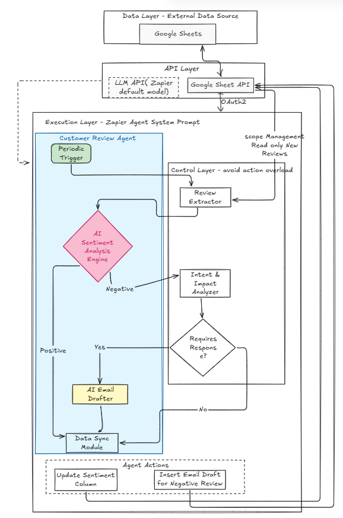

# CustomerReviewAgent

**Overview**
This is a simple agent that demonstrates its capability to analyze Customer reviews and distinguish them as Positive or Negative and generates an email draft for the negative ones. 
All the reviews are extracted in a google sheet and upon analysis the agent updates the same file as required.
Agent itself doesn't trigger any email.

# Problem Statement
Every Ecommerce team drowns in customer reviews and misses critical signals that has significant business impact overtime.
**Issue ** - There are hundreds of reviews across products and it's difficult to read through all of them and classify and respond.
The Customer support team might spend too much time on these analysis even before responding. 

# Goal
Build an AI agent that reads the customer review, analyzes sentiments and updates email drafts where necessary (Negative Reviews). 

# Solution
A Zapier agent with optimized system prompt monitors the incoming customer reviews; LLM model analyzes the sentiment and intent- decides whether a response is required or not and Drafts a Professional and empathetic email reply for the negative reviews. Running a scheduled trigger to fetch any new customer review serves a managed scope intent. 

**System Design**

**Scaling Strategy**

